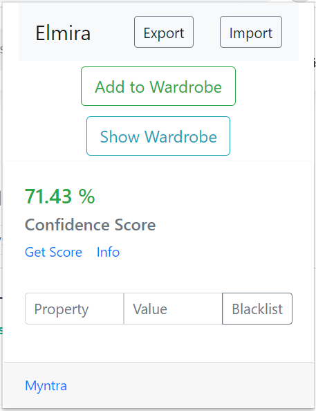

#  Elmira 
## A Smart Virtual Wardrobe
Elmira reads data from [Myntra](https://www.myntra.com/) and helps you keep track of your wardrobe (the items you own) and gives a score about which item you should buy next.

## Installation
- Download and extract the Zip of the repository.
- Visit [chrome://extensions/](chrome://extensions/) and turn on the Developer mode on the top right corner.
- Click on `Load unpacked` and select the extracted directory. The extension is installed

 

## Usage
- Click on the extension and visit Myntra.
- Add some products in your wardrobe by clicking on `Add to Wardrobe`.
- Elmira will learn your preferences as your wardrobe grows.
- You can blacklist product specifications in the extension.
- You can view/modify your wardrobe by clicking on `Show Wardrobe`.
- You can view/modify your blacklist items in the wardrobe.
- To see the confidence score for a product, click on `Get Score` in the extension.
- You can know the <i>why</i> behind the score by clicking on `Info`.
- You can export/import the Wardrobe by clicking on `Export` / `Import`.

## Customization

- Elmira penalizes attributes differently to calculate the score. To modify the penalty you may edit [js/penalty.js](./js/penalty.js).

### Thank you!
